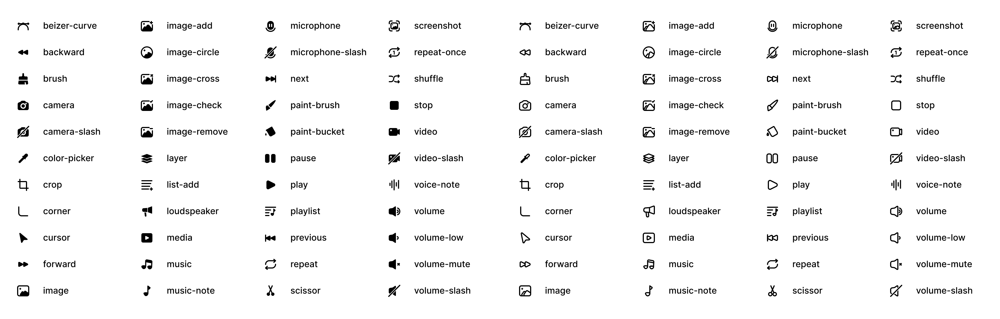

<h1 align="center">Rayna Icons</h1>

JS & React libraries made up of icons from the RaynaUI design system.

  
  

## Libraries

This monorepo is made up of two libraries. They can be found in the `packages/` folder.

| Package                                                                                                 | Version                                                                                             |
| ------------------------------------------------------------------------------------------------------- | --------------------------------------------------------------------------------------------------- |
| **[raynaicons](/packages/raynaicons)**   JavaScript/TypeScript applications running in the browser |  |
| **[raynaicons-react](/packages/raynaicons-react)**   For React applications                        |  |

## Contributing

### Feedback, ideas, and bug reports

If you found a bug, or you have general feedback about any of the libraries, open an issue using the feedback or bug template.

### Request an Icon

To request for a new icon to be added to the library, open an issue using the icon request template.

## License

This library is MIT licensed.
